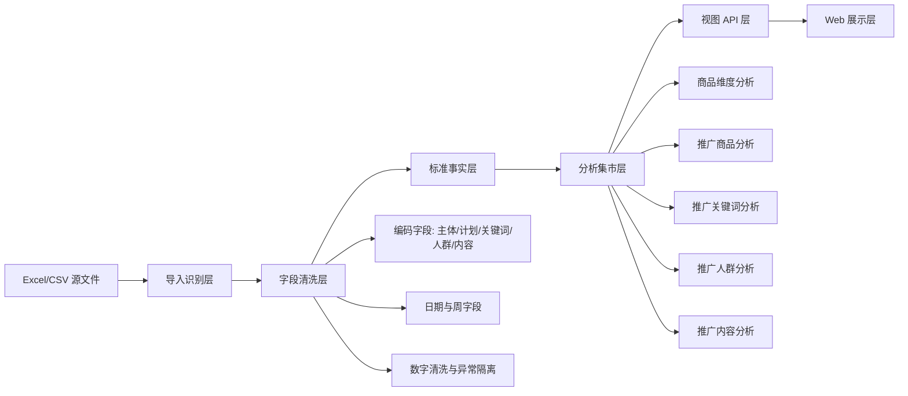

# 货盘分析 BI Web 端架构设计

## 1. Chrome 复核结论

参考原 BI 地址后，确认它的真实形态不是一个普通多页面网站，而是一个 BI 编辑器项目：

- 项目名：`货盘分析BI`
- 展示态：深色大屏，看板顶部只有全局 `日期区间` 参数。
- 编辑态：浅色 BI 工作台，左侧是来源表与分析表，画布中是图表组件。
- 画布形态：`1920x1080` 基础画布，但实际是超长纵向仪表板，商品、推广商品、关键词、人群等模块按纵向堆叠。
- 血缘视图：`5 张来源表 -> 5 张分析表 -> 多个图表组件 -> 货盘分析BI`。

因此，Web 端不应该复刻 BI 拖拽编辑器，而应该把原 BI 的“源表、分析表、图表组件、全局参数”固化成一个业务型 SaaS：用户导入源数据后，系统自动生成固定分析视图。

## 2. 产品定位

这个工具的核心不是报表陈列，而是“货品经营 + 推广投放”的一体化诊断台。

面向用户：

- 店铺负责人：看货盘结构、主销商品、费用效率、退款与复购。
- 投放运营：看场景、计划、关键词、人群、内容的花费和投产。
- 复盘人员：按周追踪指标变化，定位增长、低效和异常。

一句话定位：

> 导入商品与推广源表后，自动生成商品经营、推广投放、关键词、人群、内容五类诊断视图，并用统一指标口径支撑投放优化。

## 3. 架构总览

系统分成 6 层：

1. **导入识别层**：识别 5 类源文件，处理 GB18030 CSV 与 XLSX。
2. **字段清洗层**：统一日期、数字、空值、文本型数字，生成标准编码字段。
3. **标准事实层**：保留原始日粒度数据，保证可追溯。
4. **分析集市层**：固化 BI 里的上下合并、分类汇总、排序和指标计算。
5. **视图 API 层**：按页面一次性返回树图、趋势、词云、气泡、明细表数据。
6. **Web 展示层**：固定导航和固定组件，避免用户理解 BI 编辑器复杂度。

## 4. 数据模型

### 4.1 原始层

| 表 | 来源文件 | 用途 |
| --- | --- | --- |
| `raw_product_daily` | 生参商品排行榜 | 商品经营日数据 |
| `raw_ad_item_daily` | 推广商品报表 | 商品/计划/场景投放数据 |
| `raw_ad_content_daily` | 推广内容报表 | 内容与短视频投放数据 |
| `raw_ad_keyword_daily` | 推广关键词报表 | 关键词、词包投放数据 |
| `raw_ad_crowd_daily` | 推广人群报表 | 人群、单元、场景投放数据 |

### 4.2 标准字段层

| 字段 | 生成逻辑 | 用途 |
| --- | --- | --- |
| `subject_code` | 商品或主体 ID + 名称 | 商品树图、推广主体树图 |
| `plan_code` | 计划名字 + 主体名称 | 推广计划明细 |
| `keyword_code` | 词类型 + 词名/词包 + 宝贝名称 | 关键词明细 |
| `crowd_code` | 人群名字 + 场景名字 + 单元名字 | 人群明细 |
| `content_code` | 主体类型 + 主体名称 | 内容明细 |
| `week_label` | 周序号 + 周一至周日范围 | 周趋势指标矩阵 |

### 4.3 集市层

| 集市表 | 来源 | 说明 |
| --- | --- | --- |
| `mart_product_subject` | 商品维度 | 商品经营汇总 |
| `mart_product_weekly` | 商品维度 | 商品周趋势，新增支付金额、访客、转化、退款、复购、加购、ROI |
| `mart_ad_subject` | 推广商品 + 推广内容 | 推广主体树图 |
| `mart_ad_scene` | 推广商品 + 推广内容 | 场景柱线图 |
| `mart_ad_weekly` | 推广商品 + 推广内容 | 推广周趋势指标矩阵 |
| `mart_ad_plan` | 推广商品 + 推广内容 | 计划明细 |
| `mart_keyword` | 推广关键词 | 关键词词云、饼图、气泡、明细 |
| `mart_crowd` | 推广人群 | 人群词云、场景词云、明细 |
| `mart_content` | 推广内容 | 内容树图、内容明细 |

## 5. 关键数据流

### 5.1 商品经营流

`生参商品排行榜 -> 商品维度标准化 -> 按 subject_code 汇总 -> 商品树图 + 商品表 + 商品周趋势`

重点口径：

- 支付金额、访客、支付买家数等先汇总。
- 转化率、客单价、费比、退款占比、复购、加购、ROI 都用汇总后的分子分母再计算。
- 年累计支付金额取 `MAX`，不要把累计值求和。
- 商品页补充一个和推广商品页同形式的周趋势矩阵。

### 5.2 推广商品流

`推广商品报表 UNION ALL 推广内容报表 -> 按主体/场景/计划/周汇总 -> 推广商品页`

必须合并推广内容报表，因为原 BI 的推广商品分析里包含 `超级短视频` 场景，这部分来自内容报表。

页面组件：

- 推广主体树图：面积为花费，颜色为投产。
- 场景柱线图：柱为花费，线为投产和引潜比。
- 周趋势矩阵：花费、投产、点击单价、点击率、转化率、客单价、间接转化率、引潜比、加购成本、千次展现成本。
- 计划明细表：按 `plan_code` 排序展示。

### 5.3 关键词流

`推广关键词报表 -> keyword_code -> 关键词词云/词类型占比/气泡/明细`

原 BI 中关键词页面上半部分是三图并排：

- 词云：看高消耗词与主推词。
- 饼图：看关键词与关键词包花费结构。
- 气泡：看花费、转化与成交规模关系。

Web 端要增加“图表渲染隔离”：词云长文本较多，任何单个图表异常不能导致整页白屏。

### 5.4 人群流

`推广人群报表 -> crowd_code -> 场景词云/人群词云/人群明细`

原 BI 中人群页上半部分是场景词云和人群大词云，下方是明细表。

Web 端建议人群页增加两个辅助筛选：

- 场景筛选：人群推广、关键词推广、货品全站推、超级短视频等。
- 花费阈值：默认只看花费大于 0 的人群编码。

### 5.5 内容流

`推广内容报表 -> content_code -> 内容树图 + 内容明细`

内容页在原 BI 左侧存在，且数据被推广商品页复用。Web 端保留独立页面，用于短视频/内容投放复盘。

## 6. Web 端页面结构

左侧导航建议保留 6 个入口：

1. 商品维度分析
2. 推广商品分析
3. 推广关键词分析
4. 推广人群分析
5. 推广内容分析
6. 源数据

顶部全局参数：

- 日期开始
- 日期结束
- 场景筛选，仅在推广视图出现
- 搜索框，用于商品、计划、人群、词搜索

页面内固定模块：

- KPI 摘要区
- 主图表区
- 趋势区
- 明细表区
- 导出入口

## 7. API 设计

| API | 返回内容 |
| --- | --- |
| `GET /api/meta` | 数据源、日期范围、可用场景 |
| `GET /api/product` | 商品 KPI、树图、周趋势、明细 |
| `GET /api/ad-products` | 推广 KPI、主体树图、场景图、周趋势、计划明细 |
| `GET /api/keywords` | 关键词 KPI、词云、类型占比、气泡、明细 |
| `GET /api/crowds` | 人群 KPI、场景词云、人群词云、明细 |
| `GET /api/contents` | 内容 KPI、树图、明细 |
| `GET /api/export` | 当前视图筛选结果导出 |

所有视图 API 统一支持：

- `start`
- `end`
- `scene`
- `q`

## 8. 前端组件拆分

| 组件 | 作用 |
| --- | --- |
| `AppShell` | 左侧导航、顶部筛选、页面切换 |
| `MetricCard` | KPI 卡片 |
| `EChart` | ECharts 图表容器，内置错误隔离 |
| `DataTable` | 明细表、分页、宽表横向滚动 |
| `WeeklyMatrix` | 多指标周趋势矩阵 |
| `SourceStatus` | 源表状态与数据范围 |

前端策略：

- 固定业务视图，不暴露拖拽配置。
- 每个图表独立容错，避免单图异常造成整页空白。
- 词云、气泡等高风险图表限制点数与文本长度。
- 明细表保留分页，避免一次渲染几千行造成卡顿。

## 9. 异常处理原则

原 BI 里能看到 `#VALUE!`，说明源数据存在空值、文本数字、分母为 0 或公式异常。Web 端要在数据层解决：

- 数字列统一清洗为 number。
- 无法转换的值记为 `null`，同时保留异常计数。
- 分母为 0 时返回 `null`，前端显示 `-`。
- 比率指标统一使用 ratio of sums。
- 图表数据为空时展示空状态，不展示空白页面。

## 10. 开发优先级

### P0

- 源数据接入与日期筛选。
- 商品维度分析：树图、周趋势、明细表。
- 推广商品分析：树图、场景图、周趋势、计划明细。
- 关键词和人群页面至少要有 KPI、核心图表、明细，不允许空白。

### P1

- 推广关键词完整诊断。
- 推广人群完整诊断。
- 推广内容独立页面。
- 导出当前筛选数据。

### P2

- 高花费低投产预警。
- 高转化低消耗机会识别。
- 商品费比、退款、复购、加购综合评分。
- 周环比变化和异常点标记。

